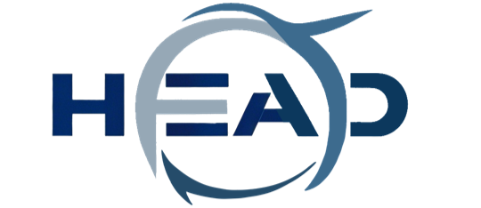
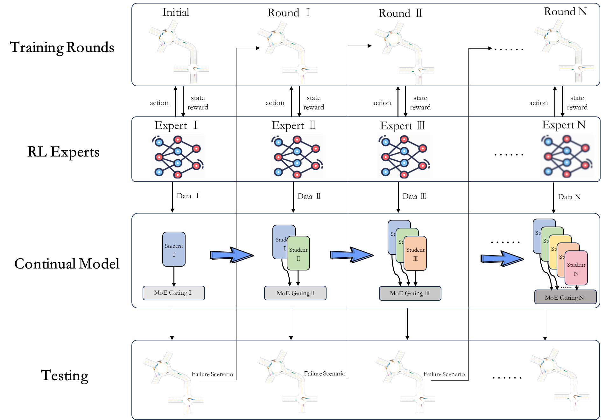
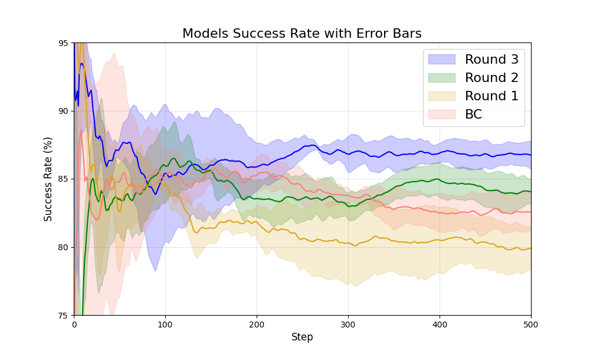
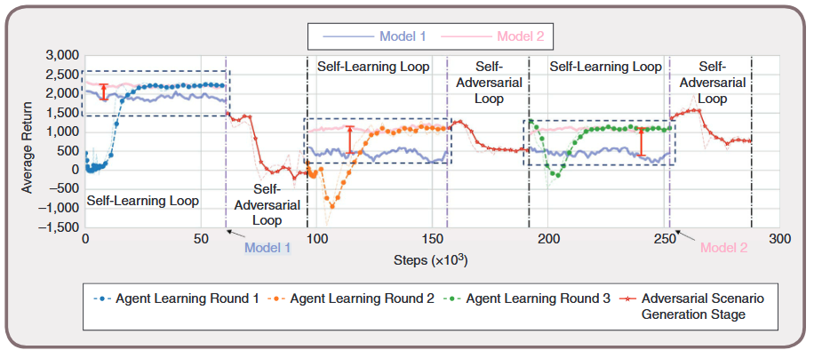

<br>


<br>
# HEAD:Holistic Evolutionary Autonomous Driving
**HEAD (Holistic Evolutionary Autonomous Driving)** 


## Introduction

**HEAD (Holistic Evolutionary Autonomous Driving)** is an Autonomous Driving Platform with the following key features: 
- **A General Self-Evolutionary Autonomous Driving Software Tool**: It combines learning-based, optimization-based, and rule-based algorithms to efficiently handle complex driving scenarios and ensure safety and performance.
- **Integration with Simulation Testing**: It is deeply integrated with the MetaDrive simulation platform, enabling comprehensive testing and optimization.
- **A Closed-Loop Data-Driven Platform**: It provides a complete closed-loop system from scenario generation to algorithm evolution, enhancing adaptability and reliability in unseen scenarios through adversarial testing and continuous learning.


## 🔧Quick Start
1. **Clone the repo**

   Start by cloning the HEAD repository to your local machine:
    ``` bash
    git clone https://github.com/TJHuangteam/HEAD.git
    cd HEAD
   ```
2. **Conda Env Settings and Install Dependencies**
    ``` bash
    conda create -n HEAD python=3.9
    conda activate HEAD
    pip install -r requirements.txt
    ```


#### 对抗环

对抗场景生成


#### 算法环

持续学习


#### 自学习环


## Examples

#### 算法环实验

##### 架构



Continual Expert Imitation Learning (CEIL) 是一种有效的自动驾驶持续学习框架，它结合了强化学习和监督学习的优势，以提高自动驾驶系统在复杂场景下的训练效率和模型性能。在该框架中，通过强化学习（如Soft Actor-Critic），训练多个 RL Coaches 来执行不同场景中的策略，并生成用于模仿学习的数据。这些 RL Coaches 输入状态向量（包含车辆、自车信息、导航信息和环境信息），输出连续驾驶动作。通过在仿真环境中大量的试错学习，RL Coaches生成高质量的数据，包括状态-动作对、轨迹和策略信息。

随后，Continual Model 对这些数据进行模仿学习。训练是逐步进行的，每阶段会引入一个新的子专家模型（Expert），通过监督学习模仿前一阶段的教练行为，以最小化预测误差。在整个训练过程中，持续学习模型的门控机制帮助模型合理选择和使用最适合当前场景的子专家模型，从而提高了多场景下的适应性和决策精度。

整个流程通过 RL Coaches 生成的数据逐步训练 Continual Model，使其具备理解和应对不同驾驶场景的能力。最终，模型在已知和新场景中进行测试，验证其泛化能力，确保在复杂环境中保持良好表现。这种方法有效地提高了模型的鲁棒性和进化能力，使其在自动驾驶等复杂任务中具备广泛的适应性。


##### 实验结果


多轮迭代进化



#### HEAD进化实验



## References

If you use HEAD in your own work, please cite:


解释


## Acknowledgements

Github:[GitHub - metadriverse/metadrive: MetaDrive: Open-source driving simulator](https://github.com/metadriverse/metadrive)

Website:[MetaDrive | MetaDriverse](https://metadriverse.github.io//metadrive/)


``` text
@article{yang2024guarantee,
  title={How to guarantee driving safety for autonomous vehicles in a real-world environment: a perspective on self-evolution mechanisms},
  author={Yang, Shuo and Huang, Yanjun and Li, Li and Feng, Shuo and Na, Xiaoxiang and Chen, Hong and Khajepour, Amir},
  journal={IEEE Intelligent Transportation Systems Magazine},
  year={2024},
  publisher={IEEE}
}
```


## Relevant Projects

**Metadrive: Composing diverse driving scenarios for generalizable reinforcement learning**
\
Li, Quanyi and Peng, Zhenghao and Feng, Lan and Zhang, Qihang and Xue, Zhenghai and Zhou, Bolei
\
*IEEE Transactions on Pattern Analysis and Machine Intelligence*
\
[
<a href="https://arxiv.org/pdf/2109.12674.pdf">Paper</a>
|
<a href="https://metadriverse.github.io/metadrive-simulator/">Website</a>
|
<a href="https://github.com/metadriverse/metadrive">Code</a>
]


## License

All assets and code are under the [Apache 2.0 license](./LICENSE) unless specified otherwise.


